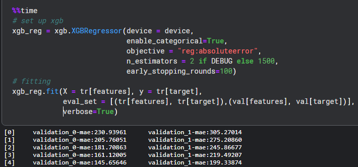
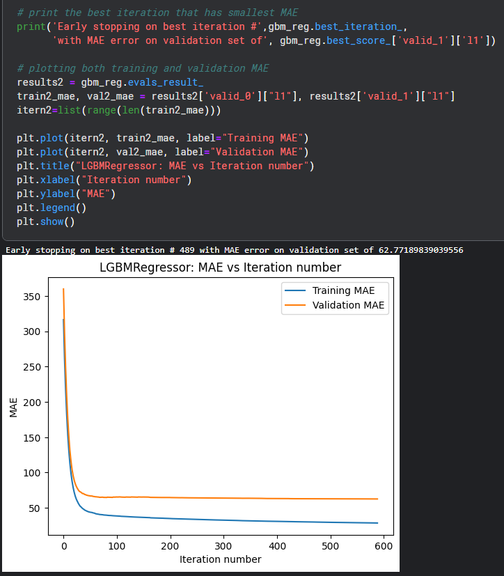
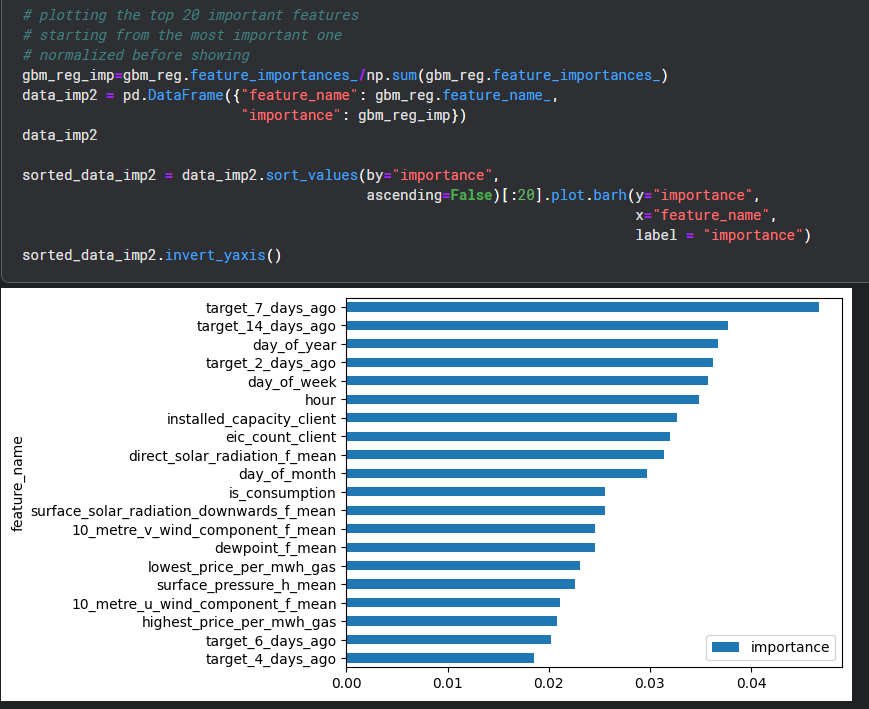

# ML-Project-Enefit
This is a machine learning project (and a kaggle competition) that aims to build an energy prediction model; for reducing the imbalance costs due to the increasing number of prosumers. The gradient-boosting frameworks XGBoost and LightGBM are used to perform the regression task. 

The detail description can be found in:
https://www.kaggle.com/competitions/predict-energy-behavior-of-prosumers

Some of the datasets are too large to upload, but they can be downloaded here:
https://www.kaggle.com/competitions/predict-energy-behavior-of-prosumers/data

In general, there are 3 sections in the code:

**1. Data preparation:**
   Data cleaning, sorting and feature engineering, followed by data splitting for training and validation.
   
**2. XGBoost approach:**
   Applying XGBoost algorithm for training and evaluation of the model.
   
**3. LightGBM approach:**
   Applying LightGBM algorithm for training and evaluation of the model.

## 1. Data preparation and feature engineering
This section aims to combine all datasets into one that can be trained by the model.

First of all, let's load up all datasets:

For each dataset, its shape and first observation are printed out:

Data cleaning, sorting and grouping are then performed (The code is too long, please take a look at the code).

Feature "data_block_id" is used for data splitting. Observations with data_block_id = 0 to 499 are for training while the rest are for validation. 78.25% of the data was used for training.

From feature engineering, prediction can also be based on the energy usage ("target") certain days ago:

At the end, "Target" (energy comsumption/production amount) is the response variable, while 59 features are used as explanatory varibles:

## 2. XGBoost
Applying XGBoost algorithm to train on the training set and generate a fit for prediction. Categorical data are allowed and 1500 gradient boosted trees are used.

Note that mean absolute error (MAE) is calculated for evaluation on the model performance. The algorithm will stop earlier if there is no obvious decrease in loss value for 100 iterations (early_stopping_round = 100) instead of going through all iterations.

A plot is produced to see both training and validation error. The best iteration is round #278 and the corresponding MAE is 61.55.

A horizontal bar plot is also used to see the importance of feature (top 20).

It seems that XGBoost determines the target (i.e power usage) 2 and 7 days ago are the major features that helps to predict future target.

## 3. LightBGM
LightGBM algorithm is also applied with same settings as XGBoost:

The algorithm found that at iteration #489, best performance of the model is reached with MAE 62.77.

For the importance of features, the LightBGM indicates that there are no dominant features (while XGBoost indicates there are two features):

It does seems that the predictions of LightGBM depends on all features instead of depending on few features.
