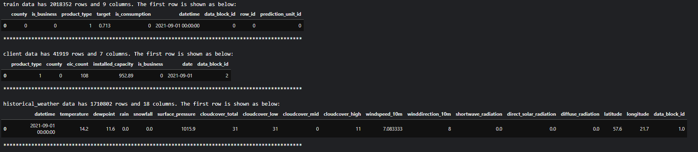
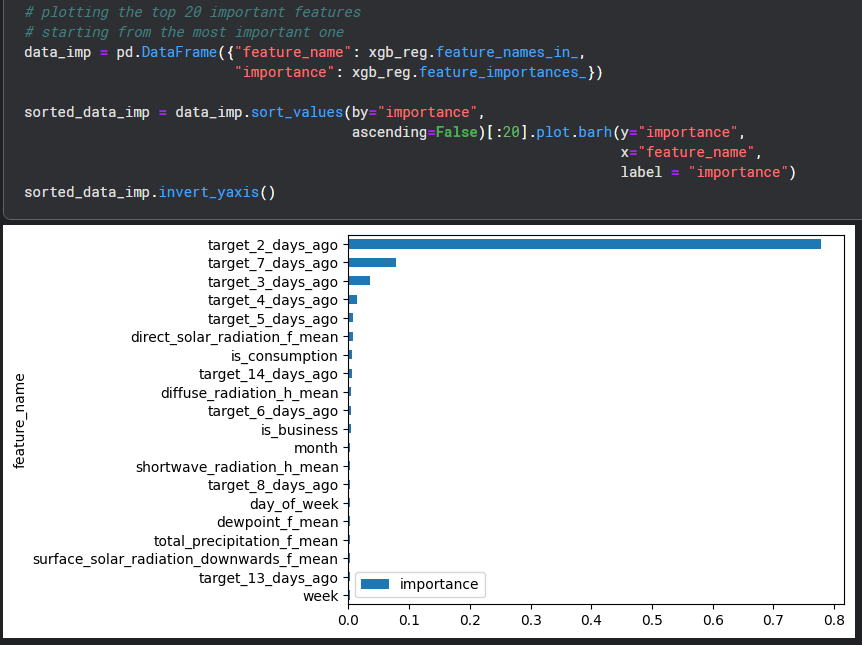

# ML-Project-Enefit
This is a machine learning project (and a kaggle competition) that aims to build an energy prediction model; for reducing the imbalance costs due to the increasing number of prosumers.

The detail description can be found in:
https://www.kaggle.com/competitions/predict-energy-behavior-of-prosumers

Some of the datasets are too large to upload, but they can be downloaded here:
https://www.kaggle.com/competitions/predict-energy-behavior-of-prosumers/data

In general, there are 3 sections in the code:
1. Data preparation: Data cleaning, sorting and feature engineering, followed by data splitting for training and validation.
2. XGBoost approach: Applying XGBoost algorithm for training and evaluation of the model.
3. LightGBM approach Applying LightGBM algorithm for training and evaluation of the model.

### 1. Data preparation and feature engineering
This section aims to combine all datasets into one that can be trained by the model.

Load all datasets:

cleaning and sorting are performed. Feature engineering is performed such that the prediction based on number of days before the day of prediction.

78.25% of the data was used for training. "Target" (energy comsumption/production amount) is the response variable while all other features are explanatory.

### 2. XGBoost
Applying XGBoost algorithm to train on the training set and generate a fit for prediction. Categorical data are allowed and 1500 gradient boosted trees are used with 100 early stopping rounds. Note that MAE (L1 distance) is calculated for evaluation on the model performance.

A plot is produced to see both training and validation error.

A horizontal bar plot is used to see the importance of feature (top 20). 

### 3. LightBGM
Similar structure as XGBoost section, but with LightBGM algorithm.

